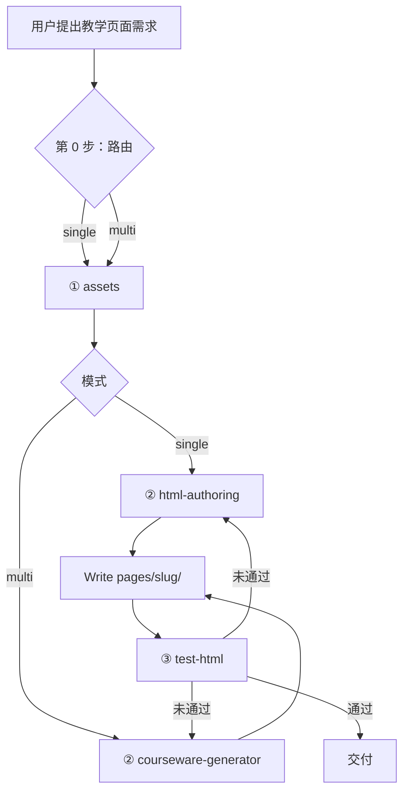

# Teaching Page v2 — Workflow 主流程

> 规范**全部在本目录**（`teaching-page-v2/`），不 Read 仓库根目录或其他 Skill 包。

## 总览



## 第 0 步：路由

**multi 信号词**：多页、课件、PPT、翻页、缩略图、页数 ≥2。

**single 默认**：单页游戏、动画、海报、练习、闯关。

---

## 第 ① 步：素材

**Read** [assets/SKILL.md](assets/SKILL.md)

产出：`assets-manifest.md`、spec 草稿；multi 另写 `outline.md` 并用户确认。

---

## 第 ② 步：生成

### single

```
Read html-authoring/SKILL.md
  → Read html-authoring/guide.md
  → 数学：Read html-authoring/math-design/*.md
  → Read feixiang-style.md（视觉补充）
  → Write pages/<slug>/index.html
```

### multi

```
Read courseware-generator/SKILL.md
  → Read courseware-generator/guide.md
  → Read content-guide.md + style-guide.md
  → Read pages/<slug>/outline.md
  → Write pages/<slug>/index.html
  → 复制 assets/courseware-shell.js → pages/<slug>/
```

---

## 第 ③ 步：测试

**Read** [test-html/SKILL.md](test-html/SKILL.md)

浏览器手测 must-cover → 验证结论卡 → 不通过回 ②。

---

## 回退

改 HTML 后必须重跑 ③；改需求/素材从 ① 补差。
