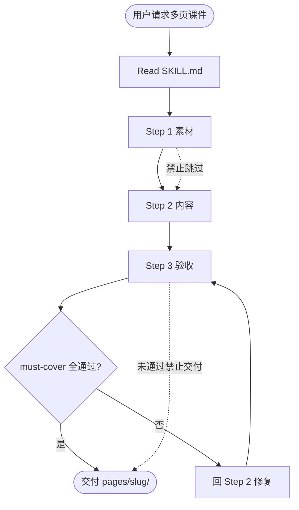
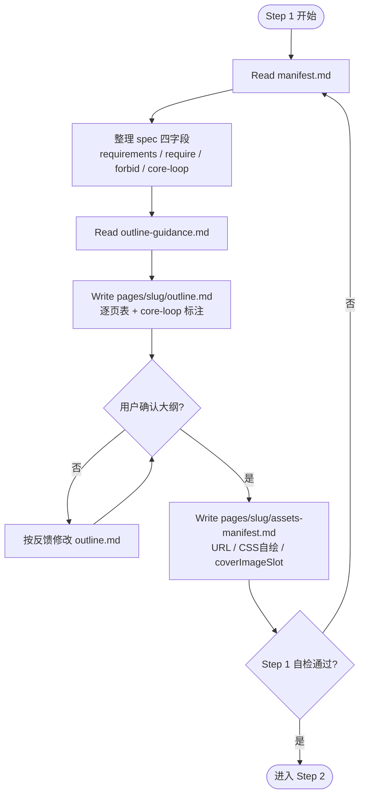
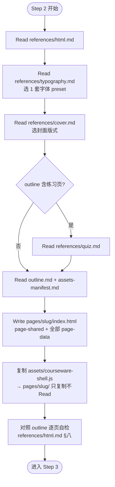
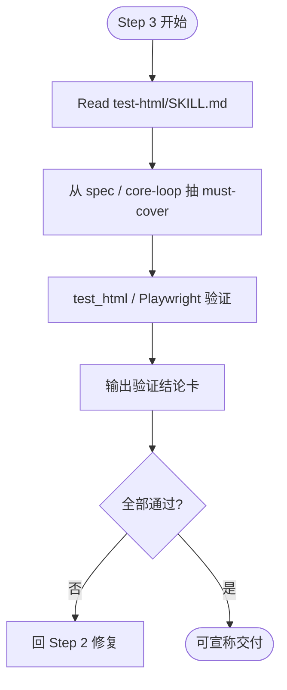
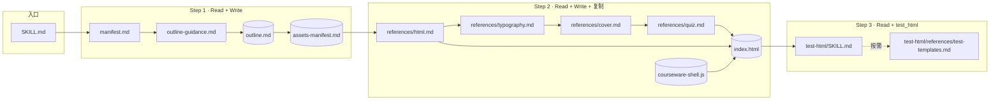

# 多页课件 · 调用流程图（开发者文档）

> 路径：`courseware-generator/只供用户查看的调用流程.md`  
> **⚠️ 仅供开发者阅读，Agent 执行时不要 Read 本文件。** 实际调用以 `SKILL.md` 为准。

---

## 总览

---

## Step 1：素材

**产物**：`outline.md`、`assets-manifest.md`

---

## Step 2：内容

**产物**：`index.html`、`courseware-shell.js`

---

## Step 3：验收

**外部 Skill**：`test-html/SKILL.md`

---

## 文件调用关系

| 图例 | 含义 |
|------|------|
| 方框 | Skill 内 md（Read） |
| 圆角框 | 产物文件（Write 或复制） |
| 虚线禁止 | 跳过 Step 1 / 未验收即交付 |
