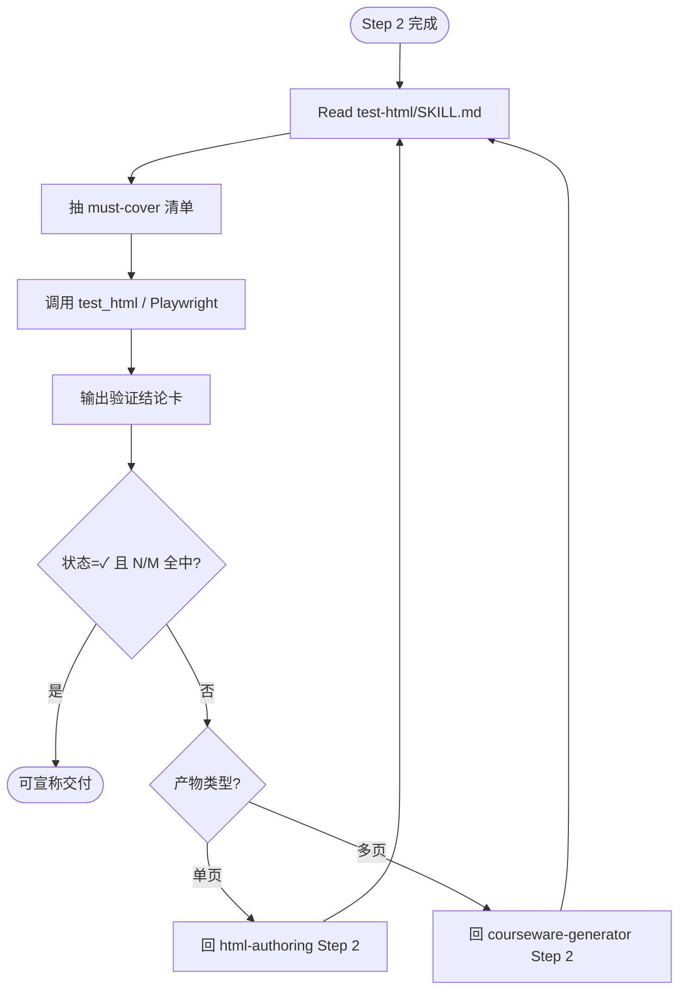
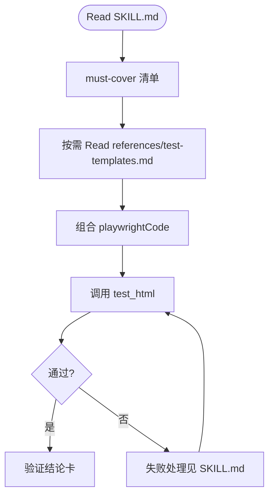
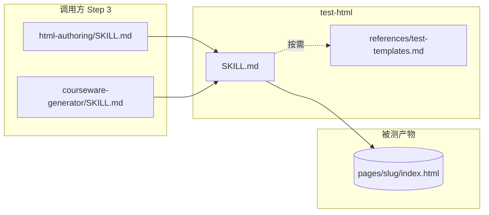

# 验收阶段 · 调用流程图（开发者文档）

> 路径：`test-html/只供用户查看的调用流程.md`  
> **⚠️ 仅供开发者阅读，Agent 执行时不要 Read 本文件。** 实际调用以 `test-html/SKILL.md` 为准。

---

## 总览

---

## Playwright 分支

---

## 文件调用关系

| 图例 | 含义 |
|------|------|
| 实线 | 必读 / 执行路径 |
| 虚线 | 写 playwrightCode 时按需 Read |
