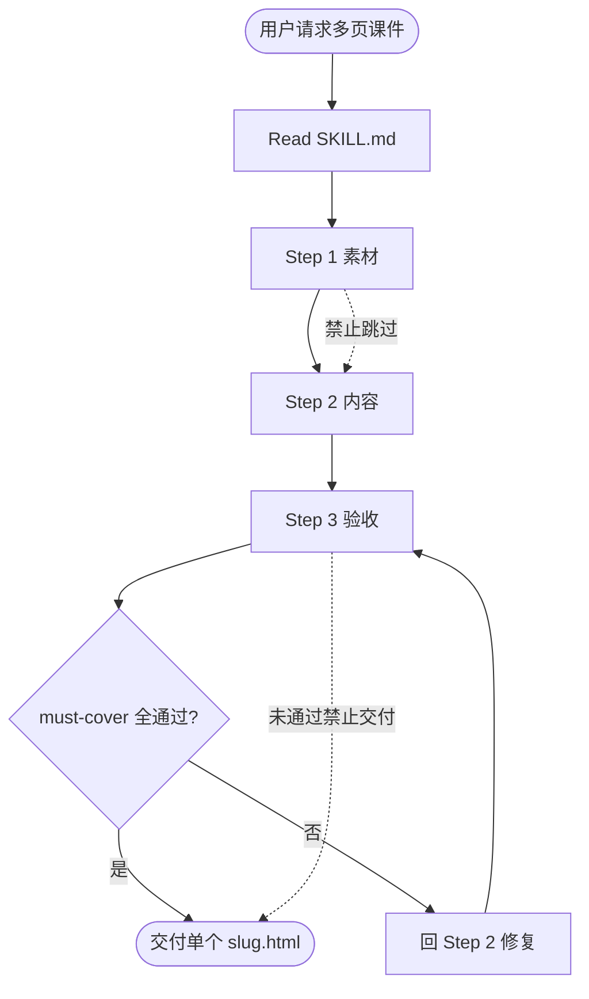
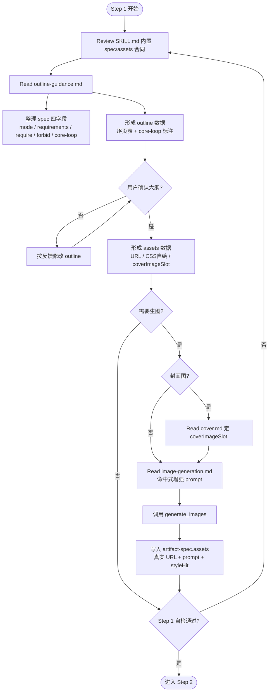
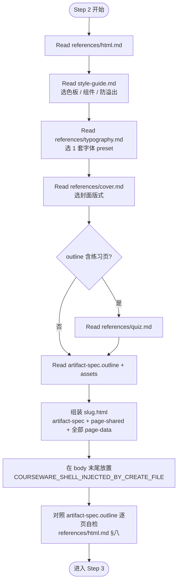
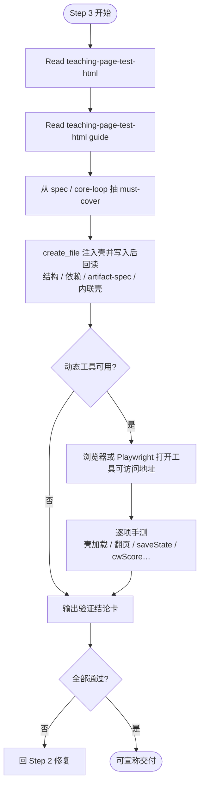

# 多页课件 · 调用流程图

> 路径：`courseware-generator/workflow.md`
> 入口：`SKILL.md`。下图展示 Read / Write / create_file 注入壳 / 验收的调用顺序与分支。

---

## 总览

---

## Step 1：素材

**阶段数据**：`artifact-spec.outline`、`artifact-spec.assets`  
**生图闸门**：调用 `generate_images` 前必读 `references/cover.md`（封面）+ `references/image-generation.md`；工具不可用则自绘并声明。

---

## Step 2：内容

**产物**：单个 `<slug>.html`

---

## Step 3：验收

**外部 Skill**：`teaching-page-test-html`

---

## 文件调用关系

```mermaid
flowchart LR
    subgraph entry [入口]
        SKILL[SKILL.md]
    end

    subgraph step1 [Step 1 · Read + Write]
        CONTRACT[SKILL.md 内置 spec/assets 合同]
        OUTLINE_G[outline-guidance.md]
        OUTLINE_W[(artifact-spec.outline)]
        ASSETS_W[(artifact-spec.assets)]
    end

    subgraph step2 [Step 2 · Read + Write + 占位符]
        HTML_R[references/html.md]
        STYLE_R[style-guide.md]
        TYPO_R[references/typography.md]
        COVER_R[references/cover.md]
        QUIZ_R[references/quiz.md]
        PLACEHOLDER_W[(COURSEWARE_SHELL_INJECTED_BY_CREATE_FILE)]
        INDEX_W[(slug.html)]
    end

    subgraph step3 [Step 3 · Read + 浏览器]
        TEST[teaching-page-test-html]
        GUIDE[teaching-page-test-html guide]
    end

    SKILL --> CONTRACT
    CONTRACT --> OUTLINE_G
    OUTLINE_G --> OUTLINE_W
    OUTLINE_W --> ASSETS_W

    ASSETS_W --> HTML_R
    HTML_R --> STYLE_R
    STYLE_R --> TYPO_R
    TYPO_R --> COVER_R
    COVER_R --> QUIZ_R
    QUIZ_R --> INDEX_W
    HTML_R --> INDEX_W
    PLACEHOLDER_W --> INDEX_W

    INDEX_W --> TEST
    TEST --> GUIDE
```

| 图例 | 含义 |
|------|------|
| 方框 | Skill 内 md（Read） |
| 圆角框 | 阶段数据、源文件或最终产物 |
| 虚线禁止 | 跳过 Step 1 / 未验收即交付 |
